# WWF WrestleMania, recompiled

A C port of Midway's *WWF WrestleMania: The Arcade Game* (1995, Wolf Unit / TMS34010 hardware, ROM revision
"REV 1.30 8/10/95"), translated from the original assembly source in
[historicalsource/wwf-wrestlemania](https://github.com/historicalsource/wwf-wrestlemania). The game logic is the
original code, translated to C; the port loads the original `.IMG` art directly, and any image can be replaced with a
higher-resolution PNG (see [docs/ASSET_OVERRIDES.md](docs/ASSET_OVERRIDES.md)). It runs on a desktop and as an Android
app (tried on an Nvidia Shield TV).

On top of the original game it has a wide, zooming view, high-resolution art, an in-game settings menu, and a set of
**mods** that add what the arcade machine never had: four players, a cooperative championship ladder, an unused
wrestler and a folding chair. Without a mod switched on the game plays as the original.

## Screenshots

Taken with the AI-upscaled art described under [High-resolution art](#high-resolution-art), at a render scale of 3.

### Four players

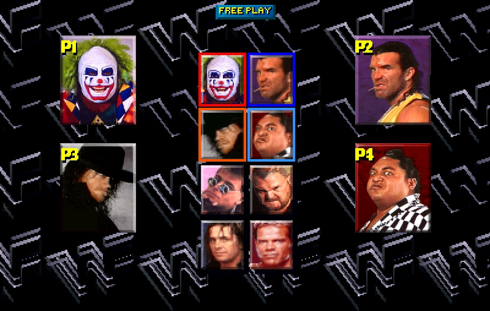

*The character select screen with four people (mod `fourplayer`). Players 1 and 2 are the game's own players; players
3 and 4 join with their start button and get a square of their own on the grid (P1 red, P2 blue, P3 orange, P4 light
blue) and a labelled portrait. Every square flashes white when its player has picked.*

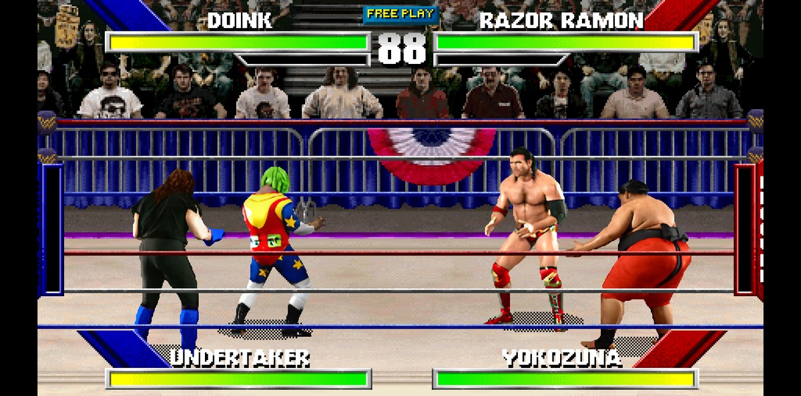

*The same four people in a match, two against two: Doink and Undertaker against Razor Ramon and Yokozuna. The partners
play the game's buddy-mode places, and their energy bars sit along the bottom.*

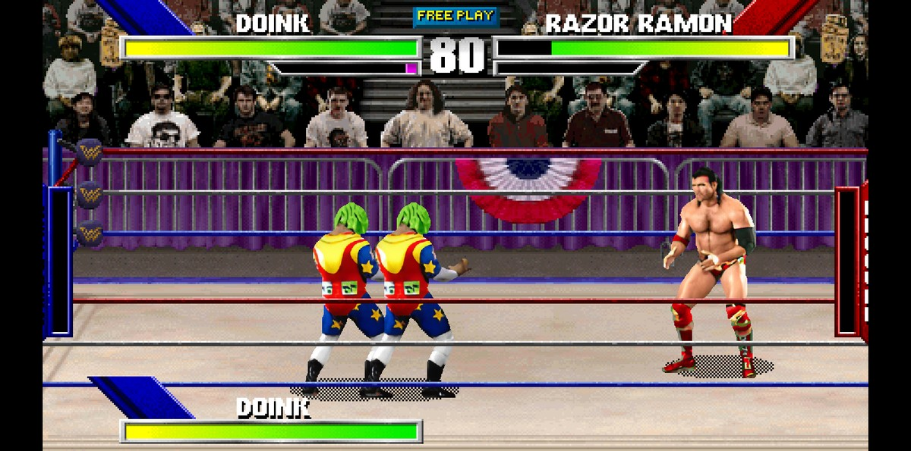

*A computer buddy for one side only, here for player 1 (the settings P1 BUDDY and P2 BUDDY in the F1 menu): Doink and a
second Doink against Razor Ramon alone.*

### A view that follows the fight

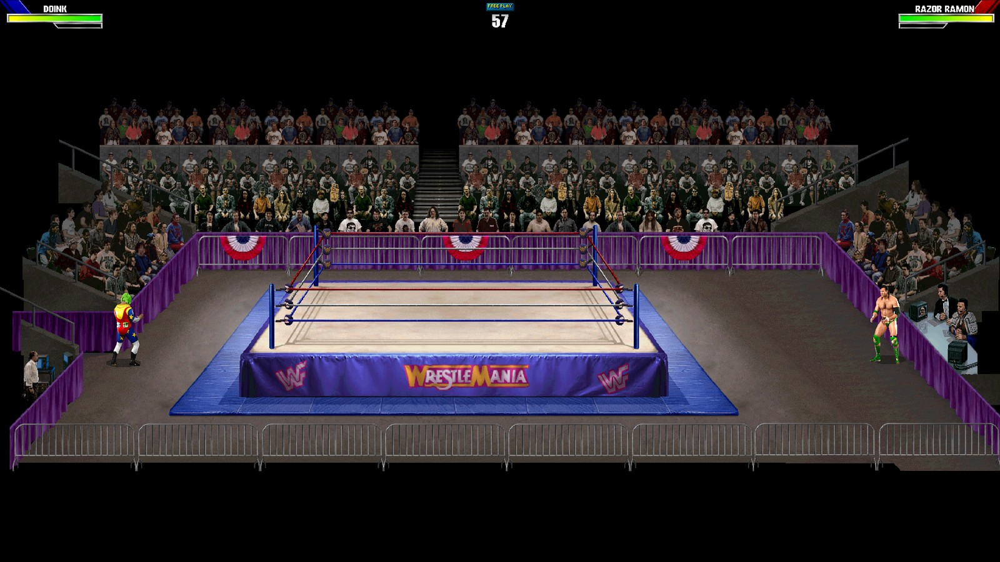

*Dynamic zoom: the view is wider than the arcade's 400x254 picture and zooms out as the wrestlers move apart. Here, with
FREE ROAM on, Doink and Razor Ramon have walked out of the ring to opposite ends of the arena, and the whole arena is
in view (the zoom is limited to 30 to 100 percent in this picture; the limits are in the menu).*

### The F1 menu

The game pauses while the menu is open (F1, or Start + Back on a controller). Every game option has a line of help
text, and the numbers of the mods are shown as words.

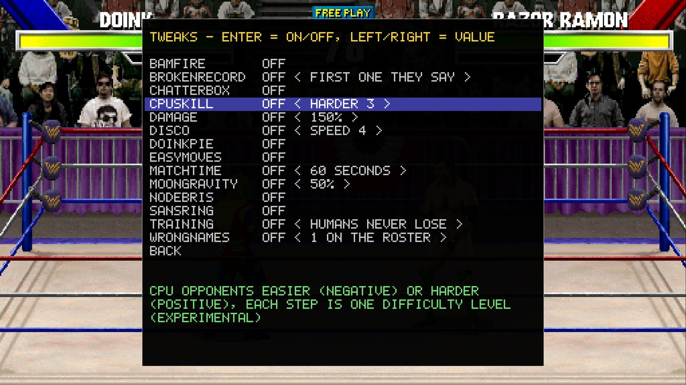

*TWEAKS: mods that can be switched on and off at any time, also in a match. Left and right change the value, here "CPU
skill: harder 3".*

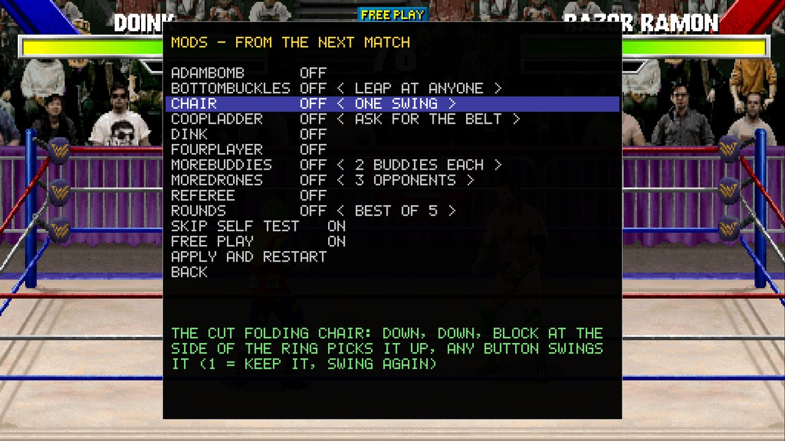

*MODS: mods that build something when a match or the game starts; a change shows from the next match or start.*

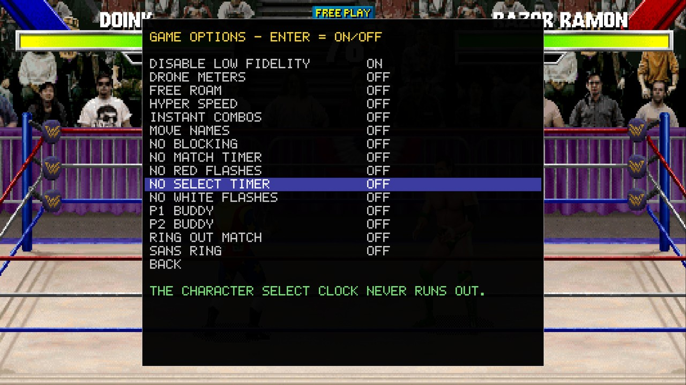

*GAME OPTIONS: the game's own secret powerups (no blocking, instant combos, hyper speed, ...) and a few conveniences
such as FREE ROAM, no select timer, and a computer buddy for each player.*

### More wrestlers and a cooperative ladder

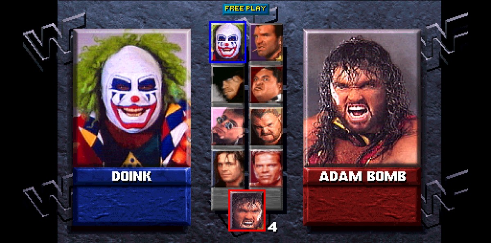

*Mod `adambomb`: the wrestler Lex Luger replaced late in development gets a square under the eight on the select
screen. His animation frames are in the original data.*

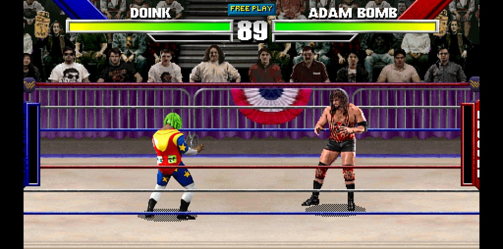

*Doink against Adam Bomb in the ring.*

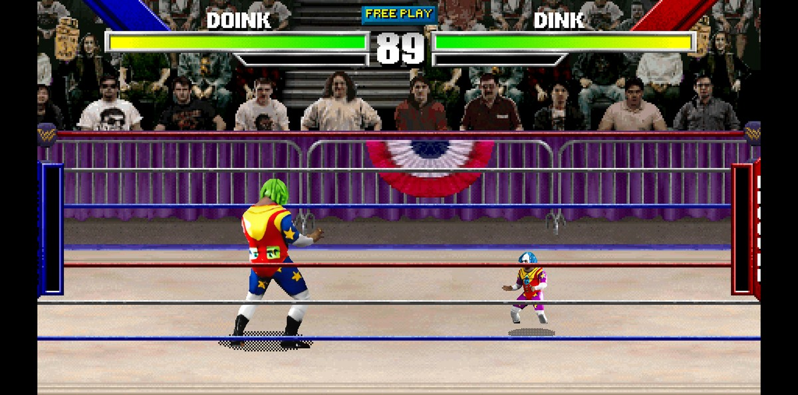

*Mod `dink`: Dink, Doink's little sidekick, is Doink drawn at half size and gets his own square.*

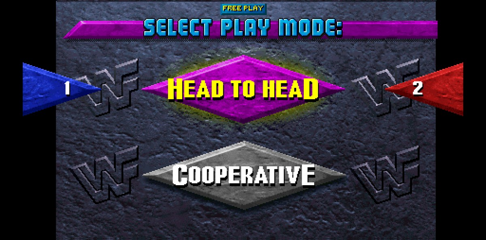
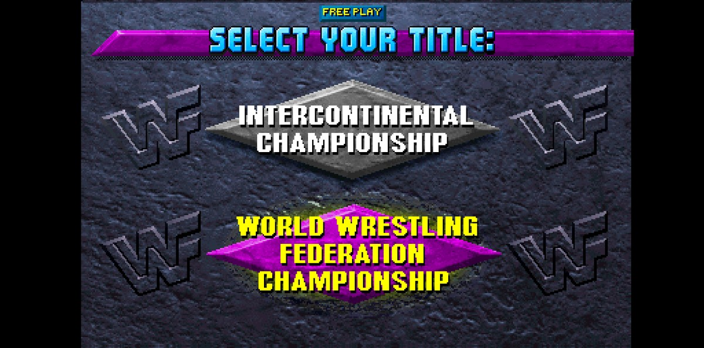

*Mod `coopladder` (two players only): choosing COOPERATIVE starts the championship ladder for both players as one team.
The game asks for the belt, then goes through the seven matches.*

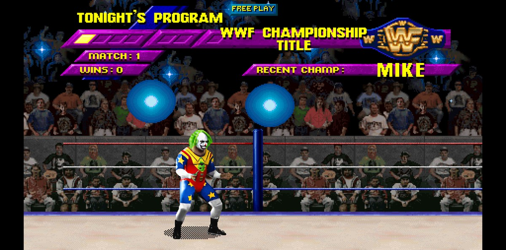
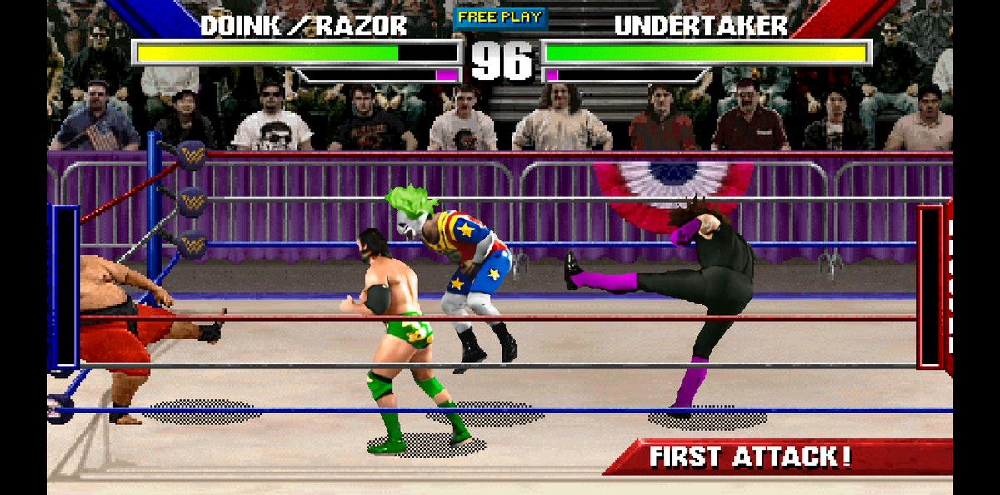

*The ladder screen with both players, and the first match: Doink and Razor Ramon against Yokozuna and Undertaker.*

### Climbing the crowd fence

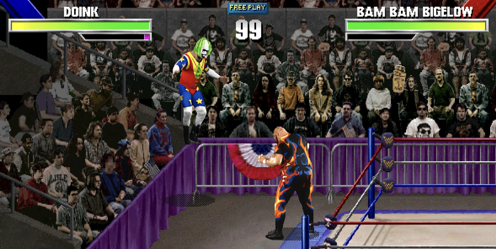

*Mod `bottombuckles`: Doink has left the ring and climbed onto the back left corner of the crowd fence, standing above the
crowd while Bam Bam Bigelow waits in the aisle. At a corner of the fence (Up + Left or Right at the back corners, Down +
Left or Right at the front ones) the wrestler jumps up with his own climb animation, and from there he can leap at the
opponent.*

### The chair

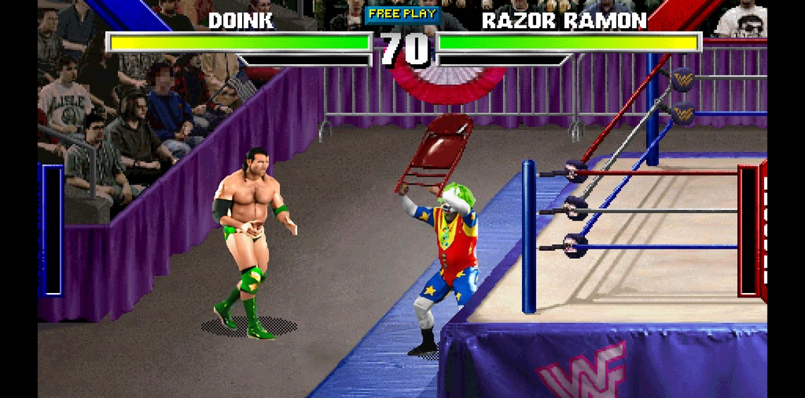

*THE CHAIR!!*

## High-resolution art

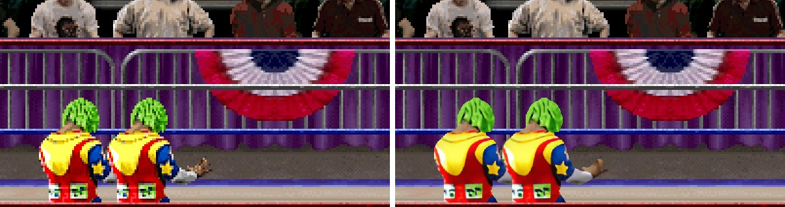

*Left: the original art, scaled up. Right: the same frame with the AI-redrawn art.*

The art in the screenshots was redrawn at 4x with generative image models running in ComfyUI
(`tools/remaster/`, see [docs/REMASTER.md](docs/REMASTER.md)):

- **SDXL checkpoint:** RealVisXL V5.0 (`RealVisXL_V5.0_fp16.safetensors`, from `SG161222/RealVisXL_V5.0`)
- **ControlNet:** the SDXL tile ControlNet `xinsir/controlnet-tile-sdxl-1.0`, which keeps the redrawn image close to the
  original
- **Upscale model:** Real-ESRGAN x4plus (`RealESRGAN_x4plus.pth`, xinntao/Real-ESRGAN)
- Sampler: dpmpp_2m with the karras scheduler, 28 steps; the colors of the original are kept
  (`--keep-color 1`) so that the game's palette effects (player 2's colors, flashes, fades) keep working

There is also a lighter pipeline, `tools/ai_upscale.py`, that uses the Real-ESRGAN network `realesr-animevideov3`.
Generative models add detail the original never had, so the result can differ from the original drawings and not every
image has been looked at. The redrawn art is **not** part of this repository: it is made on your own machine from your
own copy of the game's data.

## Status

The recompiled game boots, passes its power-up self test, runs attract
mode and plays matches, with the original art loaded from the IMG/BDD
files. Sound and music play from WAV files extracted once from your sound
ROMs (see [Sound](#sound)).

| Step | What                                                    | State |
|------|---------------------------------------------------------|-------|
| 1    | IMG/LOD loader, image catalog, `imgtool`                | done  |
| 2    | Renderer: DMA blitter, color RAM, overrides, SDL2       | done  |
| 3a   | Assembler front-end for the original source             | done  |
| 3b   | Regenerated image, sequence and background tables       | done  |
| 3c   | TMS34010 → C recompiler, runtime, Wolf Unit hardware    | done  |
| 4a   | Sound: DCS extraction (`dcsrip`), file player, SDL audio | done |
| 4b   | Fidelity checks against real hardware                   | next  |

## Mods and the view

New features are kept apart from the port as mods in `mods/`, switched on
with `wwf --mod NAME` (`wwf --list-mods`); see [docs/MODS.md](docs/MODS.md).
The window shows up to 56 pixels more on each side than the original
400x254 screen (the game is told to draw that far), matching the window's shape (`--classic` for the original
view, F11 for full screen, `--res 1920x1080` for a window size: the view is
planned for its shape, with more rows above and below as well as columns;
`--scale` is the render sharpness and `--zoom Z` (or the mouse wheel, +/-,
0 resets) magnifies the middle; see the table in docs/VIDEO.md); see [docs/VIDEO.md](docs/VIDEO.md).

## In-game menu

`F1` opens a menu over the game (which pauses while it is open): zoom (left/right),
full screen, key bindings for both players and the coin/test/service keys
(Enter on a line, then press the new key; a key that is already used swaps
places), reset keys, and save. "Apply and restart" (main menu, game options and mods pages) saves the
settings and starts the game again, for what only takes effect at start (free play, the self test, a
mod's changes); the mods that are on and their numbers are kept, and `--mod`/`--free-play` on the command
line give way to the saved settings. Settings are saved to `wwf.cfg` (`--config FILE`
for another path) and read at the next start; command line options win. The
menu is drawn by the SDL front end (`src/platform/menu.c`) with a built-in
font, so it does not depend on the game's own art. It has only been started
with SDL's dummy driver here; the drawing and key handling have not been seen
in a window.

## Android (tested on an NVIDIA Shield TV Pro)

The Android app is the same game in an SDL2 activity (a Leanback app for Android TV). It has been built and run on an
**NVIDIA Shield TV Pro** (arm64, a controller, the GPU path on); other devices have not been tried. Game controllers play
players 1 to 4 in the order they connect. **Start + Back** open the F1 menu (Guide belongs to Android TV).

Build on macOS (Windows: `android\setup-windows.bat`, then `android\build-windows.bat install`):

```sh
sh android/setup-mac.sh                     # once: Java 17, the Android SDK and NDK (Homebrew)
tools/fetch_orig.sh                         # the original game, if orig/ is empty
sh android/build-mac.sh --nodata --install  # a small APK, installed over adb (USB or network debugging on)
```

`--nodata` leaves the game's data out of the APK (with everything in it the APK is over 1 GB, and a device with little
room refuses it). Start the app once so that it makes its folder, then push the data with `D=/sdcard/Android/data/org.wwf.wrestlemania/files`:

```sh
adb push orig/IMG $D/orig/IMG
adb push build/gen $D/gen       # the generated tables (it must come from the same build as the APK)
adb push art/hd $D/art/hd       # optional: high-resolution art (PNG overrides, see docs/REMASTER.md)
adb push sounds $D/sounds       # optional: sounds extracted with dcsrip (docs/SOUND.md)
```

Without `--nodata`, `sh android/build-mac.sh --install` puts everything that exists at build time into the APK. After
changing the mods or the translator, add `--regen`, and push `build/gen` again. Settings (`wwf.cfg`) are saved by the F1
menu; "apply and restart" asks you to start the app again by hand. HD art, GPU drawing, precaching and the memory limits
of a TV box are described in [docs/ANDROID.md](docs/ANDROID.md) and [docs/VIDEO.md](docs/VIDEO.md); the HD art needs a lot
of memory, and the debug page of the menu can show the frame rate and what the game had to limit.

## Xbox (planned)

A build for **Xbox in developer mode** is planned. Developer mode runs UWP apps that are installed over the console's
Device Portal, so the port would be wrapped in a UWP project (SDL2 has a UWP backend). **Nothing of it has been built or
tried yet**: there is no Xbox project in this repository, and how the game would run there (the picture would be drawn by
SDL's Direct3D 11 renderer, not the OpenGL ES 2 path used on Android, and an app in developer mode has a limited share of
the console's memory) is not known. It will be written and tested when the author has a console to try it on. Until
then the Platforms list below is the whole truth about what has been tried.

## Platforms

Only **macOS, Android (an NVIDIA Shield TV Pro) and Linux** have been tried. The Windows build is **not tested on Windows**: `tools/build_windows.sh`
(MinGW-w64, cross-compiled from a Mac or Linux) builds warning-free and its result ran under Wine, and
`tools/build_windows.bat` (Visual Studio, CMake and Python on Windows) has not been run at all. The code is plain C11 with
SDL2 in `src/platform/` only, so it should build with MSVC, but that has not been checked. `tools/build_linux.sh` builds
the desktop version on Linux; `android/build-mac.sh` and `android/build-windows.bat` build the Android app
(docs/ANDROID.md).

## Building

**The original game is not in this repository.** The port is built from, and runs on, the original source and art
(Midway's, published in
[historicalsource/wwf-wrestlemania](https://github.com/historicalsource/wwf-wrestlemania)). Fetch it into `orig/` first
(see [orig/README.md](orig/README.md)):

```sh
tools/fetch_orig.sh
```


SDL2 is needed only for `wwf` and `imgview`; the core builds
without it.

```sh
cmake -S . -B build
cmake --build build
ctest --test-dir build --output-on-failure
```

### Windows from a Mac (or Linux)

`tools/build_windows.sh` cross-compiles with MinGW-w64 (`brew install
mingw-w64 cmake`), downloads the SDL2 MinGW package and collects `wwf.exe`,
`SDL2.dll`, the generated `gen/` folder, `orig/IMG` and a `wwf.bat` in
`dist-windows/`. Copy that folder to the Windows machine. Add the extracted
`sounds/` folder next to `wwf.exe` for sound. It builds warning-free on Linux
with MinGW-w64 and the result runs under Wine (self test, a match); it has not
been run on real Windows, nor built on a Mac, and MSVC was not tried.

### macOS

```sh
xcode-select --install           # compiler, make, python3
brew install cmake sdl2
cmake -S . -B build -DCMAKE_BUILD_TYPE=Release
cmake --build build -j8          # first build: a few minutes (generated code)
./build/wwf --scale 3
```

## Playing

```sh
./build/wwf --scale 3                 # add --art art/hd for high-res overrides, --gpu to draw with OpenGL ES 2 (docs/VIDEO.md)
```

The keys for player 1 / player 2 are (players 3 and 4, for the `fourplayer` mod, are in the F1 menu and
`mods/fourplayer/README.md`):
- **Move:** arrows / I J K L
- **Punch / block / super punch / kick / super kick:** A S D F R / G H ; ' P
- **Run** (punch + kick pressed together): Space / \
- **Start:** 1 / 2
- **Coin:** 5 / 6
- **Test:** F2
- **Quit:** Esc

The first start resets the CMOS ("factory settings"). Press a button to
continue.

## Sound

The sound ROMs are not in the repository. With your own copy (a directory
or MAME's `wwfmania.zip` holding `wwf_music-spch_l1.u2` ... `.u5`),
extract the sounds once:

```sh
./build/dcsrip path/to/roms sounds    # takes a while; writes sounds/*.wav
./build/wwf --scale 3                 # finds ./sounds by itself
```

`dcsrip` runs the sound board's own program on an ADSP-2105 emulation and
records every sound, music with exact loop points. The game plays the
files and does not emulate anything. Replace any WAV by putting one with the
same name in a directory and passing `--sound-art DIR`. `--mute` turns sound
off. Details are in [docs/SOUND.md](docs/SOUND.md).

Headless runs are for tests and debugging:

```sh
./build/wwfrun build/gen orig/IMG 3000 --shots shots --every 100 \
    --input 1500,10,p1,16 --profile 500
```

## imgtool

```sh
./build/imgtool info    orig/IMG/DNK_HIT.IMG          # list images/palettes
./build/imgtool export  orig/IMG/DNK_HIT.IMG out/     # one library -> PNGs
./build/imgtool catalog orig/IMG [override_dir]       # load the game's LOD set
./build/imgtool find    orig/IMG D4BK3A06             # look up one label
./build/imgtool dump    orig/IMG art/original         # every game image + manifest
./build/imgtool render  orig/IMG D4BK3A06 out.png --scale 4 --override art/hd
```

Add `--indexed` to `export`/`dump` for 8-bit palette PNGs, which is the
format overrides use.

## imgview

```sh
./build/imgview orig/IMG [override_dir] --scale 4 [--label NAME]
```

This browses every game image through the port's DMA renderer. Keys:
←/→ switch image, H/V flip, F hit flash, +/- DMA scale, O toggle overrides,
R reload overrides.

## License

The code of this port (everything in this repository) is free software under the **GNU General Public License, version 3
or later**; see [LICENSE](LICENSE). Copyright (C) 2026 Lurendrejer and contributors. If you pass on a changed version,
you must give the source of your changes under the same license and keep the copyright and license notices.

The license covers only what is in this repository. It does **not** cover Midway's original game: the source and art
published at [historicalsource/wwf-wrestlemania](https://github.com/historicalsource/wwf-wrestlemania), which this port is
translated from, are not part of this repository and keep their own rights. The same goes for sounds extracted from the
sound ROMs and for art redrawn from the original art. This port is based on that original work; please say so when you
share it.

## Layout

- `orig/`: (not in the repository; `tools/fetch_orig.sh` downloads it) the original source and art from
  [historicalsource/wwf-wrestlemania](https://github.com/historicalsource/wwf-wrestlemania)
  (commit `1280555`), kept byte for byte; never edit it
- `src/assets/`: IMG, LOD, catalog and PNG loaders (no dependencies)
- `src/video/`: video hardware model: framebuffer, color RAM, DMA blitter,
  image and override cache (no dependencies; see
  [docs/VIDEO.md](docs/VIDEO.md))
- `src/cpu/`: TMS34010 runtime for the recompiled code
- `src/wolf/`: Wolf Unit hardware model (memory map, DMA, I/O, PIC, sound latches)
- `src/sound/`: plays the extracted sounds for the game's sound commands (no dependencies)
- `src/platform/`: SDL2 window, audio, presentation and the `wwf` executable
- `tools/dcs/`: `dcsrip`, the ADSP-2105 / DCS board emulation used to extract the sounds
- `tools/gsp/`: assembler front-end, table generator and recompiler (Python)
- `src/util/`: file helpers
- `tools/`: `imgtool`, `imgview`, `wwfrun` (headless; `--sound DIR --wav FILE` records the game's audio)
- `tests/`: loader, ADSP and sound tests (synthetic ones, plus all of `orig/IMG` when it is
  present; `-DWWF_DCS_ROMS=path` adds a check with the real sound ROMs)
- `docs/`: format notes and the asset override guide
